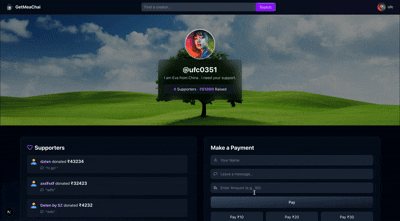
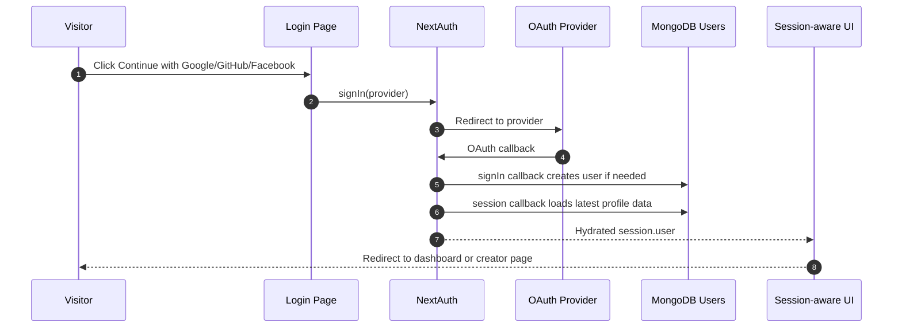
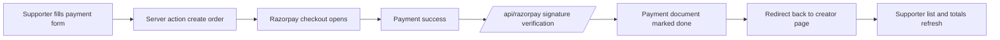

<div align="center">

# Get Me a Chai ☕

A full-stack creator funding platform where fans support creators through Razorpay-powered payments.

<a href="https://readme-typing-svg.herokuapp.com?font=Geist&weight=700&size=28&pause=1000&color=F59E0B&center=true&vCenter=true&width=1000&lines=Next.js+%2B+MongoDB+%2B+NextAuth+%2B+Razorpay;Creator+pages%2C+supporter+ledgers%2C+and+OAuth+login;Built+for+fans+who+want+to+buy+a+chai+for+creators">
  
</a>

<p>
  
  
  
  
</p>

<p>
  
  
  
</p>

<p>
  
  
  
  
  
  
</p>

</div>

---
## ✨ Highlights

- 🔐 OAuth Authentication (Google, GitHub, Facebook)
- ☕ Razorpay Test Mode Integration
- 👤 Personalized Creator Pages
- 💳 Secure Payment Verification
- 📊 Creator Dashboard
- ⚡ Built with Next.js App Router
- 📱 Fully Responsive Design
- 🎨 Modern Animated UI

---
## About The Project
> [!NOTE]
> This project is a learning implementation built to demonstrate authentication, database integration, and Razorpay payment workflows. Each creator configures their own Razorpay **Test Mode** API credentials to simulate independent payment processing. In a production system, payment credentials would be managed through secure merchant onboarding rather than being entered manually.

**Get Me a Chai** is a creator-support platform that lets fans send small one-time payments to people they follow. It exists to solve a simple problem: creators often need a lightweight way to accept direct support without building a full membership system, payment stack, or custom dashboard from scratch.

The app is built for creators, indie makers, streamers, artists, and anyone who wants a simple public page where supporters can send appreciation in a few clicks. Creators get a profile page, a supporter list, and a dashboard to manage their public information and Razorpay credentials. Supporters get a short, low-friction flow that feels closer to buying a chai than making a heavy pledge.

The repository shows a fully working Next.js app with OAuth login, MongoDB persistence, server actions, Razorpay order creation, signature verification, and a polished responsive UI.

---
## Why I Built This

I built this project to deepen my understanding of full-stack application development using the Next.js App Router. Rather than creating a basic CRUD application, I wanted to explore real-world concepts such as OAuth authentication, payment gateway integration, server actions, MongoDB data modeling, and responsive UI design.

The project also helped me understand how payment verification, creator dashboards, and public-facing user profiles work together in a modern web application.

---
## Screenshots

<p align="center">
  
</p>

<details>
<summary>More visual assets in <code>public/</code></summary>

The repository also includes `chai.gif`, `coin.gif`, `group.gif`, `man.gif`, `user.gif`, and `image.png` for the app's visual identity and page illustrations.

</details>

---

## Features

| Area | What it does |
| --- | --- |
| OAuth sign-in | Lets users log in with NextAuth-powered social providers. |
| Creator dashboard | Lets authenticated users edit name, username, bio, profile photo, cover image, and Razorpay credentials. |
| Live preview | Shows a real-time preview of the creator page while editing the dashboard. |
| Public support page | Renders `/{username}` as a creator-facing donation page with supporter history. |
| Razorpay checkout | Creates an order, opens the Razorpay checkout widget, and verifies the callback signature. |
| Username migration | Updates existing payment records when a creator changes their username. |
| Supporter ledger | Stores successful donations and displays them in descending amount order. |
| Informational pages | Includes About, FAQ, Privacy, and Terms pages for the public site. |
| Motion UI | Uses Framer Motion for a polished animated landing page and page transitions. |
| Toast feedback | Uses React Toastify for success and error states in the dashboard and payment flow. |

---

## 🚀 Live Demo

🔗 **Live Application:** https://get-me-a-chai-lake-kappa.vercel.app/

Experience the complete creator-support workflow, including OAuth authentication, profile management, and Razorpay Test Mode payments.

---

## Tech Stack

### Core Technologies

| Layer | Stack |
| --- | --- |
| Frontend | Next.js App Router, React 19, Tailwind CSS 4, Framer Motion |
| Backend | Next.js route handlers, server actions, Mongoose |
| Database | MongoDB |
| Authentication | NextAuth.js with GitHub, Google, Facebook, and Apple providers configured in the auth route |
| Payments | Razorpay |
| Notifications | React Toastify |
| Icons | React Icons |
| Package manager | npm |
| Deployment target | Vercel-compatible Next.js app |

### Badges

<p>
  
  
  
  
  
  
</p>

---

## Architecture

```mermaid
graph TD
  A[Visitor] --> B[Next.js App Router]
  B --> C[Landing Page]
  B --> D[Login Page]
  B --> E[Creator Dashboard]
  B --> F[Public Creator Page /{username}]
  D --> G[NextAuth OAuth Providers]
  G --> H[(MongoDB Users)]
  E --> H
  F --> I[Server Actions]
  I --> H
  I --> J[Razorpay Order Creation]
  J --> K[Razorpay Checkout]
  K --> L[/api/razorpay callback/]
  L --> M[Razorpay Signature Verification]
  M --> N[(MongoDB Payments)]
  N --> F
```

### Request Lifecycle

```mermaid
flowchart LR
  U[Supporter] --> P[Open /{username}]
  P --> Q[Fill name, message, amount]
  Q --> R[Server action: initiate]
  R --> S[Razorpay order created]
  S --> T[Checkout widget opens]
  T --> V[Payment completes]
  V --> W[/api/razorpay verifies signature/]
  W --> X[Payment marked done]
  X --> Y[Redirect back to creator page]
  Y --> Z[Supporter list refreshes]
```

---

## Folder Structure

<details>
<summary>Actual repository tree</summary>

```text
get-me-my-chai/
├── actions/
│   └── useractions.js
├── app/
│   ├── [username]/
│   │   └── page.js
│   ├── about/
│   │   └── page.js
│   ├── api/
│   │   ├── auth/
│   │   │   └── [...nextauth]/
│   │   │       └── route.js
│   │   ├── profile/
│   │   │   └── route.js
│   │   └── razorpay/
│   │       └── route.js
│   ├── dashboard/
│   │   └── page.js
│   ├── faq/
│   │   └── page.js
│   ├── globals.css
│   ├── layout.js
│   ├── login/
│   │   └── page.js
│   ├── page.js
│   ├── privacy/
│   │   └── page.js
│   └── terms/
│       └── page.js
├── components/
│   ├── ConnectDb.js
│   ├── Dashboard.js
│   ├── Faq.js
│   ├── Footer.jsx
│   ├── Hero.js
│   ├── Navbar.jsx
│   ├── PaymentPage.js
│   └── SessionWrapper.js
├── models/
│   ├── Payment.js
│   └── User.js
├── public/
│   ├── chai.gif
│   ├── coin.gif
│   ├── group.gif
│   ├── image.png
│   ├── man.gif
│   ├── project_demo.gif
│   └── user.gif
├── eslint.config.mjs
├── jsconfig.json
├── next.config.mjs
├── package-lock.json
├── package.json
├── postcss.config.mjs
└── tailwind.config.js
```

</details>

---

## Installation

### Prerequisites

| Platform | Notes |
| --- | --- |
| Windows | Use PowerShell or WSL. The same `npm` commands work. |
| Linux | Use your preferred shell. Node.js 18+ is recommended. |
| macOS | Use Terminal or iTerm. Node.js 18+ is recommended. |

### Step-by-Step

1. Clone the repository.

   ```bash
   git clone https://github.com/Shazia-Zameer-999/get-me-a-chai.git
   cd get-me-a-chai
   ```

2. Install dependencies with npm.

   ```bash
   npm install
   ```

3. Create your local environment file from the example.

   ```bash
   cp .env.example .env.local
   ```

4. Fill in the required values in `.env.local`.

5. Start the development server.

   ```bash
   npm run dev
   ```

6. Open `http://localhost:3000` in your browser.

### Build For Production

```bash
npm run build
npm start
```

---

## Environment Variables

Create a local `.env.local` file from the example below. The repository uses MongoDB for persistence and NextAuth for OAuth sign-in.

| Variable | Required | Purpose |
| --- | --- | --- |
| `MONGODB_URI` | Yes | MongoDB connection string used by `ConnectDb.js` and the API routes. |
| `NEXTAUTH_SECRET` | Yes | Secret used by NextAuth to sign and encrypt session data. |
| `NEXTAUTH_URL` | Yes in local/prod setups | Canonical application URL for NextAuth callbacks and redirects. |
| `GITHUB_ID` | Yes if GitHub login is enabled | GitHub OAuth client ID. |
| `GITHUB_SECRET` | Yes if GitHub login is enabled | GitHub OAuth client secret. |
| `GOOGLE_CLIENT_ID` | Yes if Google login is enabled | Google OAuth client ID. |
| `GOOGLE_CLIENT_SECRET` | Yes if Google login is enabled | Google OAuth client secret. |
| `FACEBOOK_CLIENT_ID` | Yes if Facebook login is enabled | Facebook OAuth client ID. |
| `FACEBOOK_CLIENT_SECRET` | Yes if Facebook login is enabled | Facebook OAuth client secret. |
| `APPLE_ID` | Yes if Apple login is enabled | Apple OAuth client ID. |
| `APPLE_SECRET` | Yes if Apple login is enabled | Apple OAuth client secret. |

<details>
<summary><code>.env.example</code></summary>

```env
# MongoDB
MONGODB_URI=mongodb://127.0.0.1:27017/get-me-a-chai

# NextAuth
NEXTAUTH_URL=http://localhost:3000
NEXTAUTH_SECRET=replace-with-a-long-random-secret

# OAuth providers used by the auth route
GITHUB_ID=your_github_client_id
GITHUB_SECRET=your_github_client_secret
GOOGLE_CLIENT_ID=your_google_client_id
GOOGLE_CLIENT_SECRET=your_google_client_secret
FACEBOOK_CLIENT_ID=your_facebook_client_id
FACEBOOK_CLIENT_SECRET=your_facebook_client_secret
APPLE_ID=your_apple_client_id
APPLE_SECRET=your_apple_client_secret
```

</details>

> Creator Razorpay keys are not stored in `.env.local`. Each creator enters their own Razorpay ID and secret from the dashboard, and those values are saved on the user record in MongoDB.

---

## Running Locally

The main commands are:

```bash
npm run dev
npm run lint
npm run build
npm start
```

Expected local behavior:

- Home page: `http://localhost:3000`
- Login page: `http://localhost:3000/login`
- Creator dashboard: `http://localhost:3000/dashboard`
- Public creator page: `http://localhost:3000/{username}`

When a payment succeeds, the callback redirects back to the creator page with `?paymentdone=true`, and the supporter list refreshes.

---

## Docker

No `Dockerfile` or `docker-compose` configuration is committed in this repository, so Docker is not part of the current workflow.

If you want to containerize it later, the app is a straightforward Next.js deployment target based on Node.js.

---

## API Documentation

### Server Actions

| Function | Location | Purpose |
| --- | --- | --- |
| `initiate({ amount, to_username, paymentform })` | `actions/useractions.js` | Creates a Razorpay order, stores a pending payment document, and returns the order payload to the client. |
| `fetchuser(username)` | `actions/useractions.js` | Loads a creator profile by username. |
| `fetchpayments(username)` | `actions/useractions.js` | Loads completed payments for a creator, ordered by amount descending. |

### `GET` / `POST` `/api/auth/[...nextauth]`

- **Description:** NextAuth entrypoint for OAuth login, callbacks, sessions, and built-in auth routes.
- **Auth:** Handled by NextAuth.
- **Providers configured:** GitHub, Google, Facebook, Apple.
- **Notable behavior:**
  - `signIn` callback creates a `User` document if one does not already exist.
  - `session` callback hydrates the session with data from MongoDB, including username, bio, cover, and Razorpay credentials.
- **Example route family generated by NextAuth:** `/api/auth/signin`, `/api/auth/callback/:provider`, `/api/auth/session`, `/api/auth/csrf`.

### `POST` `/api/profile`

- **Description:** Updates the authenticated user's profile and payment settings.
- **Auth:** Required. The route calls `getServerSession(authOptions)` and rejects anonymous requests.
- **Body:** JSON object with any of these fields: `name`, `username`, `email`, `profile`, `cover`, `razorpayid`, `razorpaysecret`, `bio`.
- **Special behavior:** If the username changes, existing payment records are updated from the old username to the new one so supporter pages do not break.
- **Responses:**
  - `200` with `{ success: true }` on success.
  - `401` with `{ success: false, message: 'Unauthorized' }` if no session exists.
  - `500` with `{ success: false, message: 'An error occurred.' }` on failure.

Example request:

```bash
curl -X POST http://localhost:3000/api/profile \
  -H "Content-Type: application/json" \
  -d '{
    "name": "Shazia",
    "username": "shazia",
    "bio": "Designing coffee-fueled side projects",
    "profile": "https://example.com/profile.jpg",
    "cover": "https://example.com/cover.jpg",
    "razorpayid": "rzp_test_xxx",
    "razorpaysecret": "secret_xxx"
  }'
```

Example response:

```json
{
  "success": true
}
```

### `POST` `/api/razorpay`

- **Description:** Verifies Razorpay payment callbacks and finalizes successful payments.
- **Auth:** Not a NextAuth session route. Verification relies on Razorpay's signature and the creator's stored Razorpay secret.
- **Body:** Form data containing `razorpay_order_id`, `razorpay_payment_id`, and `razorpay_signature`.
- **Flow:**
  - Load the pending payment by order ID.
  - Load the creator by `to_username`.
  - Verify the signature.
  - Mark the payment as done.
  - Redirect back to `/{username}?paymentdone=true`.
- **Responses:**
  - `303` redirect on success.
  - JSON error response if the order ID is missing or signature verification fails.

Example callback payload shape:

```text
razorpay_order_id=order_xxx
razorpay_payment_id=pay_xxx
razorpay_signature=signature_xxx
```

---

## Database

The project uses two MongoDB collections through Mongoose models.

| Collection | Model | Purpose | Key fields |
| --- | --- | --- | --- |
| `users` | `User` | Stores creator accounts and profile/payment configuration. | `name`, `email`, `username`, `profile`, `cover`, `bio`, `razorpayid`, `razorpaysecret`, `createdAt`, `updatedAt` |
| `payments` | `Payment` | Stores donation records and payment status. | `name`, `to_username`, `oid`, `message`, `amount`, `done`, `createdAt`, `updatedAt` |

### Relationships

- `User.username` is the public identifier used by the creator page route.
- `Payment.to_username` links each payment to the creator who should receive it.
- A single user can have many payments.
- When a username changes, the profile API updates matching payment documents so the relationship stays intact.

### Schema Notes

- `User.email` and `User.username` are unique.
- `Payment.amount` is normalized through a Mongoose setter so the stored value is in rupees while the checkout flow still uses paise for Razorpay.
- `Payment.done` defaults to `false` until the callback verifies successfully.
- Both schemas use `timestamps: true`.

---

## Authentication

Authentication is built on NextAuth.js with OAuth providers wired in `app/api/auth/[...nextauth]/route.js`.

- The login page exposes GitHub, Google, and Facebook buttons.
- Apple is configured in the auth route and can be surfaced in the UI later.
- The `signIn` callback creates a MongoDB user record if the email is new.
- The `session` callback reads the latest user profile data from MongoDB and attaches it to `session.user`.
- The root layout wraps the application in `SessionWrapper`, so the session is available across the site.



---

## Payment Flow

The payment path is intentionally short.

1. A supporter opens `/{username}`.
2. The page loads the creator profile and completed payments through server actions.
3. The supporter enters a name, message, and amount.
4. `initiate()` creates a Razorpay order using the creator's stored Razorpay credentials.
5. The browser opens the Razorpay checkout widget.
6. Razorpay posts the callback back to `/api/razorpay`.
7. The server verifies the signature and marks the payment as done.
8. The browser is redirected back to the creator page with `paymentdone=true`.
9. The page refreshes the supporter list and totals.



---

## Project Workflow

```mermaid
flowchart TD
  A[Visitor lands on home page] --> B[Reads about the platform]
  B --> C[Signs in with OAuth]
  C --> D[Completes profile in dashboard]
  D --> E[Adds Razorpay credentials]
  E --> F[Shares public /{username} page]
  F --> G[Supporters send chai payments]
  G --> H[Payments verify and persist in MongoDB]
  H --> I[Creator sees supporters and totals]
```

---

## Technical Highlights

The repo already includes a few practical optimizations:

- MongoDB queries use `lean()` in the profile and payment fetch helpers, which avoids unnecessary Mongoose document overhead when the data is read-only.
- Database connection logic is centralized in `components/ConnectDb.js`, so the app reuses the same connection pattern across routes and server actions.
- Static visual assets live in `public/`, which keeps image delivery simple for the landing page and creator pages.
- Client-side components are limited to the places that need interactivity, such as login, dashboard editing, support forms, toasts, and animation.
- Payment verification is server-side and avoids trusting the client for final payment state.

There is no pagination or caching layer visible yet, so the supporter list is optimized for small to moderate histories rather than very large ledgers.

---

## Security

What is implemented in the codebase:

- OAuth-based sign-in through NextAuth.
- Session-aware profile updates guarded by `getServerSession(authOptions)`.
- Razorpay signature verification before a payment is marked complete.
- No raw card data is stored in MongoDB.
- Creator-specific Razorpay Test Mode API credentials are stored in MongoDB only for demonstration purposes.

### Future Security Improvements
- No custom rate limiting middleware.
- No schema validation layer such as Zod or Yup on profile/payment inputs.
- No explicit upload pipeline or media sanitization for external image URLs.
- No custom security headers or CSP configuration in `next.config.mjs`.

That means the current security model is solid for a portfolio project, but there is room to harden it before real-world scale.

---

## Error Handling

The app uses a mix of server-side checks and user-facing toasts:

- `/api/profile` returns `401` for missing sessions and `500` for unexpected server failures.
- `/api/razorpay` returns a helpful message when the order ID is missing or the signature fails.
- `initiate()` returns structured failure messages when the creator's Razorpay configuration is incomplete or invalid.
- The dashboard and payment page surface success and failure states with React Toastify.
- The public creator page gracefully falls back to `notFound()` if a username does not exist.

---

## Future Improvements

A few high-value next steps are obvious from the code:

- Add input validation for profile updates and payment form fields.
- Add rate limiting on profile updates and payment initiation endpoints.
- Replace the demo payment flow with a production-ready merchant onboarding architecture.
- Add image upload support instead of relying on pasted URLs.
- Add pagination or infinite scroll for long supporter histories.
- Add GitHub Actions for linting and build verification.
- Add a license file if the project is intended to be open source.
- Add structured observability or error reporting for production.

---

## Contributing

Contributions are welcome.

1. Fork the repository.
2. Create a branch for your change.
3. Make your edits and keep them focused.
4. Run `npm run lint` and `npm run build` before opening a pull request.
5. Open a PR with a clear description of the behavior you changed.

If you add new routes, models, or environment variables, update the README and `.env.example` in the same pull request.

---

## License

This repository does not currently include a `LICENSE` file, so the licensing status is not defined in the codebase.

If you plan to accept external contributions, add a license such as MIT or Apache 2.0 and update the badge at the top of this README.

---

## Credits

Built with:

- Next.js
- React
- Tailwind CSS
- MongoDB and Mongoose
- NextAuth.js
- Razorpay
- Framer Motion
- React Toastify
- React Icons
- Shields.io badges
- `readme-typing-svg`
- `github-readme-stats`

Local assets used throughout the UI are stored in `public/`.

---

<div align="center">

Made with ❤️ by Shazia Zameer

⭐ If you found this project interesting, consider starring the repository to support my work.
</div>
